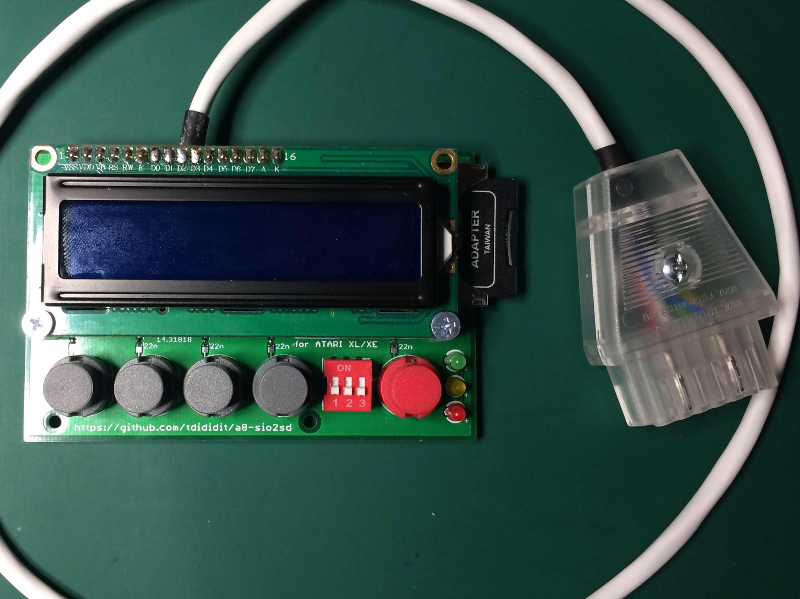

# a8-sio2sd
SIO2SD interface for Atari XL/XE

The best floppy emulator for Atari XL/XE machines ever.

Device inventor and AVR software developer: Jakub Kruszona-Zawadzki

ATARI software developer and tester: Paweł Nowak (Pajero/MadTeam)

... I just did the PCB - hope you like it :)

The board fits into STRAPUBOX 2230 universal box

Ready to use device you can order at [sellmyretro.com](https://www.sellmyretro.com/offer/details/40995)

If you want support my designer fund with small donation, you can do it via [PAYPAL.ME](https://www.paypal.me/tdididit)
